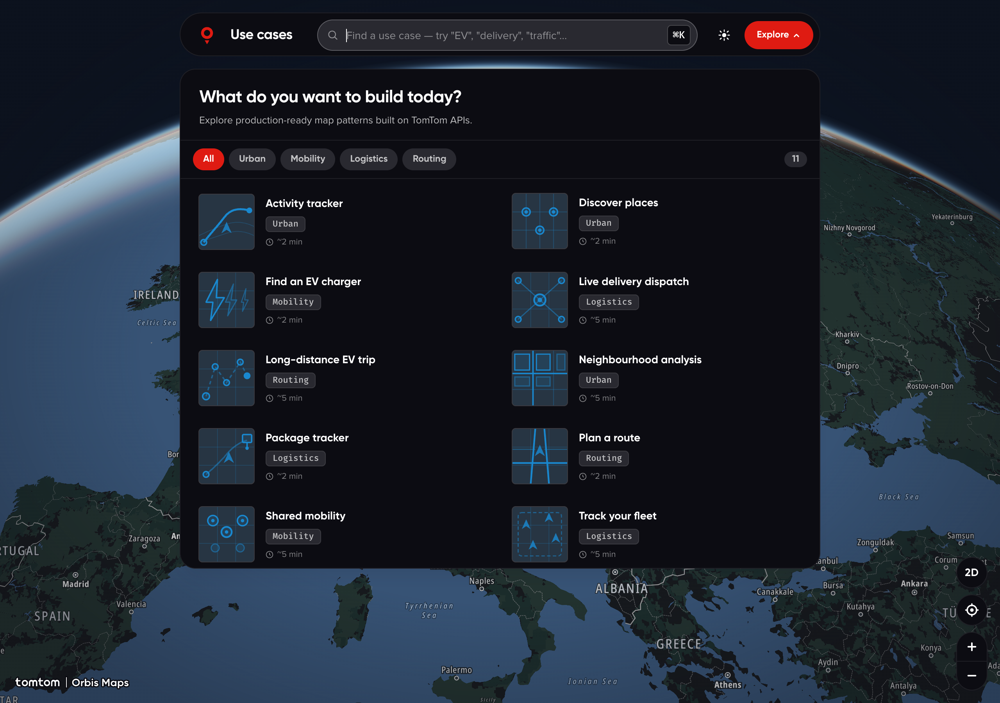

# TomTom Orbis · Use Cases Library



> ⚠️ **Work in progress · experimental.**
> This is a playground for exploring how TomTom Orbis Maps APIs feel in real-world scenarios. Nothing here is production-ready — APIs, scenes, and UI shift between commits. Don't take dependencies on it yet.

A small Vite app that boots a MapLibre map and runs interactive **use-case demos** on top of it: route planning, long-distance EV trips with charging stops, live POI inspection, traffic heatmaps, fleet tracking, delivery dispatch, and more.

Each demo is a self-contained "scene" that calls real TomTom Orbis endpoints (Routing, Search, Charging Availability, Admin Boundaries, Reverse Geocoding…) and renders the result on the same shared map.

## Running it

```bash
npm install
cp .env.example .env        # then paste your TomTom key
npm run dev
```

Open the URL Vite prints (default `http://localhost:5173/` — this project pins `5180`).

### Sharing a specific demo

Deep-link with `?case=<mapType>`:

```
http://localhost:5180/?case=multistop      # Long-distance EV trip
http://localhost:5180/?case=route          # Plan a route
http://localhost:5180/?case=ev             # Find an EV charger
```

Available slugs: `route`, `multistop`, `ev`, `poi`, `heatmap`, `package`, `delivery`, `fleet`, `city`, `realestate`, `sport`, `sharing`.

## What's in here

- `src/scenes/` — one file per use case. Each scene receives a `ctx` sandbox (markers, layers, popups, traffic toggles) and tears itself down cleanly on swap.
- `src/render/` — shared primitives (popup card, marker pin, snippet renderer).
- `src/map/` — MapLibre + TomTom SDK glue: style loading, scene context, service wrappers.
- `src/ui/` — topbar, mega-menu picker, detail panel, map controls.
- `src/data/use-cases.js` — declarative list of every demo (title, category, tools, params, snippet).

## Status

Nothing is frozen. Expect:

- Scene names, slugs, and URL shape to change
- API call patterns to be rewritten as we learn what reads cleanest
- Visual chrome (popup styling, marker style, panel layout) to shift between iterations

If you spot something off, open an issue — feedback shapes the next pass.
